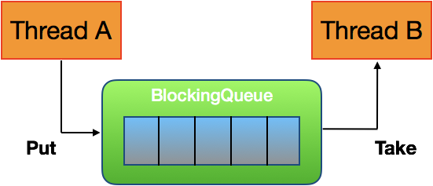
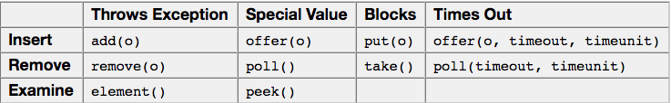

## BlockingQueue

created by Kaishen, 13 Feb, 2018

#### Easy Understanding

BlockingQueue is typically uesd in "Producer-Consumer" scenario. Thread A producer some objects and then put it into the BlockingQueue. Then Thread B consumer can retrieve objects from the queue. The diagram is shown as below.



The producer thread A will keep generating new objects and put them into the BlockingQueue while the consumer thread B keep taking from queue. 

If the queue reaches its upper bound/maximum size, the producer thread A will be blocked and have to wait. It waits for the consumer thread B to take some objects from the queue, letting the queue have empty seats again. On the other hand, the consumer thread B will be blocked if the queue is empty, waiting for the queue having something again.

There is one popular table on the Internet, but sledom understands what's the table going on. It is saying that each of those methods behaves differently when the requested operation cannot be executed immediately. Here follows the table.



**Throws Exception:** If the attempted operation is not possible immediately, an exception is thrown.

**Special Value:** If the attempted operation is not possible immediately, a special value is returned (often true / false).

**Blocks:** If the attempted operation is not possible immedidately, the method call blocks until it is.

**Times Out:** If the attempted operation is not possible immedidately, the method call blocks until it is, but waits no longer than the given timeout. Returns a special value telling whether the operation succeeded or not (typically true / false).

Do **not** support null.

#### Deep Understanding

Here shows one example of this BlockingQueue. First of all we define the producer thread A.

```java
import java.util.concurrent.BlockingQueue;

public class Producer implements Runnable {

	BlockingQueue queue = null;
	
	public Producer(BlockingQueue queue){
		this.queue = queue;
	}
	
	@Override
	public void run() {
		// TODO Auto-generated method stub
		try{
			System.out.println("The Producer starts.");
			queue.put("1");
			System.out.println("The Producer put 1 finished");
			// add this extra sleep time to see the consumer block
			Thread.sleep(1000);
			queue.put("2");
			System.out.println("The Producer put 2 finished");
			Thread.sleep(1000);
			queue.put("3");
			System.out.println("The Producer put 3 finished");
			System.out.println("The Producer ends.");
		}catch(InterruptedException e){
			e.printStackTrace();
		}
	}
}
```

Then we define the consumer thread B.

```java
import java.util.concurrent.BlockingQueue;

public class Consumer implements Runnable {
	
	BlockingQueue queue = null;
	
	public Consumer(BlockingQueue queue){
		this.queue = queue;
	}
	
	@Override
	public void run() {
		// TODO Auto-generated method stub
		try{
			System.out.println("The Consumer starts.");
			// consumer get the item third times
			Thread.sleep(5000);
			System.out.println("The Conumer 1st get "+queue.take());
			System.out.println("The Conumer 2nd get "+queue.take());
			System.out.println("The Conumer 3rd get "+queue.take());
			System.out.println("The Consumer ends.");
		}catch(InterruptedException e){
			e.printStackTrace();
		}
	}
}
```

Finally, we create a main thread that test this scenario.

```java
import java.util.concurrent.ArrayBlockingQueue;
import java.util.concurrent.BlockingQueue;

public class BlockingQueueExample {
	public static void main(String [] args) throws Exception{
		
		BlockingQueue<Integer> queue = new ArrayBlockingQueue(1024);
		
		System.out.println("The Main thread starts.");
		
		Producer producer = new Producer(queue);
		Consumer consumer = new Consumer(queue);
		
		new Thread(producer).start();
		new Thread(consumer).start();
		
		Thread.sleep(1000);
		System.out.println("The Main thread ends.");
	}
}
```

The result of above example (not necessary the same) is

```
The Main thread starts.
The Producer starts.
The Consumer starts.
The Producer put 1 finished
The Main thread ends.
The Producer put 2 finished
The Conumer 1st get 1
The Producer put 3 finished
The Producer ends.
The Conumer 2nd get 2
The Conumer 3rd get 3
The Consumer ends.
```

We see that:

Only when there is empty seat in the queue, can producer put somthing in.

Only when there is something in the queue, can consumer take something out. 

#### References Links

http://tutorials.jenkov.com/java-util-concurrent/blockingqueue.html