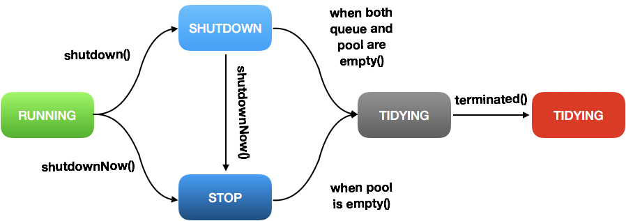

## ThreadPoolExecutor

created by Kaishen, 12 Feb, 2018

#### Easy Understanding

`ThreadPoolExecutor` let us customize our own thread-pool, which handles the thread schedule, create new thread, etc. This class is the underlying things behind many useful class such as `Executors.newCachedThreadPool`, `Executors.newFixedThreadPool`. 

***In short, we can use ThreadpoolExecutor to create our own thread pool that feeds special tasks.***

#### Deep Understanding

If we need thorough understanding of this class, we have to dive into the JDK source code. So this post is probably a note for reading the source code.

Maybe it's appropriate to start from the description inside the JDK class.

> The main pool control state, **ctl**, is an atomic integer packing two conceptual fields
>
> **workerCount**, indicating the effective number of threads 
>
> **runState**, indicating whether running, shutting down etc

This description is on top of the ThreadPoolExecutor source code, which means that the ctl is of great importance. Ctl has two information as stating above, and they are packed together for convenience.

Look at these important runStates.

```java
private final AtomicInteger ctl = new AtomicInteger(ctlOf(RUNNING, 0));
private static final int COUNT_BITS = Integer.SIZE - 3; // 32 - 3 = 29
private static final int CAPACITY   = (1 << COUNT_BITS) - 1; // last 29 bits are all ones

// runState is stored in the high-order bits
private static final int RUNNING    = -1 << COUNT_BITS;      //111  highest 32-30 bit
private static final int SHUTDOWN   =  0 << COUNT_BITS;      //000
private static final int STOP       =  1 << COUNT_BITS;      //001
private static final int TIDYING    =  2 << COUNT_BITS;      //010
private static final int TERMINATED =  3 << COUNT_BITS;      //011
```

Based on the JDK doc, we list the meaning of different status:

> **RUNNING:**  Accept new tasks and process queued tasks
>
> **SHUTDOWN:** Don't accept new tasks, but process queued tasks
>
> **STOP:** Don't accept new tasks, don't process queued tasks, and interrupt in-progress tasks
>
> **TIDYING:**  All tasks have terminated, workerCount is zero, the thread transitioning to state TIDYING will run the terminated() hook method
>
> **TERMINATED:** terminated() has completed

The transition of each run-state is shown as follows



**execute(Runnable command)**

```java
public void execute(Runnable command) {
        if (command == null)
            throw new NullPointerException();
        /*
         * Proceed in 3 steps:
         *
         * 1. If fewer than corePoolSize threads are running, try to
         * start a new thread with the given command as its first
         * task.  The call to addWorker atomically checks runState and
         * workerCount, and so prevents false alarms that would add
         * threads when it shouldn't, by returning false.
         *
         * 2. If a task can be successfully queued, then we still need
         * to double-check whether we should have added a thread
         * (because existing ones died since last checking) or that
         * the pool shut down since entry into this method. So we
         * recheck state and if necessary roll back the enqueuing if
         * stopped, or start a new thread if there are none.
         *
         * 3. If we cannot queue task, then we try to add a new
         * thread.  If it fails, we know we are shut down or saturated
         * and so reject the task.
         */
        int c = ctl.get(); // ctl has the information: runState & workerCount
        if (workerCountOf(c) < corePoolSize) {
            // later will see the addWorker method
            if (addWorker(command, true))  //true means using the corePoolSize
                return;
            c = ctl.get(); // if add thread fails, re-get the ctl state
        }
    	// if now pool is RUNNING state, and adds the cmd to queue successfully
        if (isRunning(c) && workQueue.offer(command)) {
            int recheck = ctl.get();
            // recheck the state of the pool, if the state is not Running, we have to
            // remove the command previously added. And then reject the command.
            // and then the method will return(look at the if-else if )
            if (! isRunning(recheck) && remove(command))
                reject(command);
            else if (workerCountOf(recheck) == 0)
                addWorker(null, false);
        }
        else if (!addWorker(command, false)) // false means use maxPoolSize
            reject(command);
    }
```

What exactly is a **Worker**? It is a inner class defined inside the ThreadPoolExecutor

```java
/**
     * Class Worker mainly maintains interrupt control state for
     * threads running tasks, along with other minor bookkeeping.
     * This class opportunistically extends AbstractQueuedSynchronizer
     * to simplify acquiring and releasing a lock surrounding each
     * task execution.  This protects against interrupts that are
     * intended to wake up a worker thread waiting for a task from
     * instead interrupting a task being run.  We implement a simple
     * non-reentrant mutual exclusion lock rather than use
     * ReentrantLock because we do not want worker tasks to be able to
     * reacquire the lock when they invoke pool control methods like
     * setCorePoolSize.  Additionally, to suppress interrupts until
     * the thread actually starts running tasks, we initialize lock
     * state to a negative value, and clear it upon start (in
     * runWorker).
     */
    private final class Worker
        extends AbstractQueuedSynchronizer
        implements Runnable
    {
        /**
         * This class will never be serialized, but we provide a
         * serialVersionUID to suppress a javac warning.
         */
        private static final long serialVersionUID = 6138294804551838833L;

        /** Thread this worker is running in.  Null if factory fails. */
        final Thread thread;
        /** Initial task to run.  Possibly null. */
        Runnable firstTask;
        /** Per-thread task counter */
        volatile long completedTasks;

        /**
         * Creates with given first task and thread from ThreadFactory.
         * @param firstTask the first task (null if none)
         */
        Worker(Runnable firstTask) {
            setState(-1); // inhibit interrupts until runWorker
            this.firstTask = firstTask;
            this.thread = getThreadFactory().newThread(this);
        }

        /** Delegates main run loop to outer runWorker  */
        public void run() {
            runWorker(this);
        }

        // Lock methods
        //
        // The value 0 represents the unlocked state.
        // The value 1 represents the locked state.

        protected boolean isHeldExclusively() {
            return getState() != 0;
        }

        protected boolean tryAcquire(int unused) {
            if (compareAndSetState(0, 1)) {
                setExclusiveOwnerThread(Thread.currentThread());
                return true;
            }
            return false;
        }

        protected boolean tryRelease(int unused) {
            setExclusiveOwnerThread(null);
            setState(0);
            return true;
        }

        public void lock()        { acquire(1); }
        public boolean tryLock()  { return tryAcquire(1); }
        public void unlock()      { release(1); }
        public boolean isLocked() { return isHeldExclusively(); }

        void interruptIfStarted() {
            Thread t;
            if (getState() >= 0 && (t = thread) != null && !t.isInterrupted()) {
                try {
                    t.interrupt();
                } catch (SecurityException ignore) {
                }
            }
        }
    }
```

**addWorker(Runnable firstTask, boolean core)**

```java
/**
     * Checks if a new worker can be added with respect to current
     * pool state and the given bound (either core or maximum). If so,
     * the worker count is adjusted accordingly, and, if possible, a
     * new worker is created and started, running firstTask as its
     * first task. This method returns false if the pool is stopped or
     * eligible to shut down. It also returns false if the thread
     * factory fails to create a thread when asked.  If the thread
     * creation fails, either due to the thread factory returning
     * null, or due to an exception (typically OutOfMemoryError in
     * Thread#start), we roll back cleanly.
     *
     * @param firstTask the task the new thread should run first (or
     * null if none). Workers are created with an initial first task
     * (in method execute()) to bypass queuing when there are fewer
     * than corePoolSize threads (in which case we always start one),
     * or when the queue is full (in which case we must bypass queue).
     * Initially idle threads are usually created via
     * prestartCoreThread or to replace other dying workers.
     *
     * @param core if true use corePoolSize as bound, else
     * maximumPoolSize. (A boolean indicator is used here rather than a
     * value to ensure reads of fresh values after checking other pool
     * state).
     * @return true if successful
     */
    private boolean addWorker(Runnable firstTask, boolean core) {
        retry: // this is just a label, no need to afraid, it is used for jump outside the outer loop.
        for (;;) {
            int c = ctl.get();
            int rs = runStateOf(c);
            /**this if is a little bit complicate
            *   rs > SHUTDOWN, no more new task, return false
            *   rs = SHUTDOWN, need three more conditions
            *        1. rs  == SHUTDOWN
            *        2. firstTask == null
            *        3. !workQueue.isEmpty()
            *   */
            // Check if queue empty only if necessary.
            if (rs >= SHUTDOWN &&
                ! (rs == SHUTDOWN &&
                   firstTask == null &&
                   ! workQueue.isEmpty()))
                return false;

            for (;;) {
                // effective number of working thread
                int wc = workerCountOf(c);
                if (wc >= CAPACITY ||
                    wc >= (core ? corePoolSize : maximumPoolSize))
                    return false;
                // try to add Worker, if success, break the outer loop
                if (compareAndIncrementWorkerCount(c))
                    break retry;
                c = ctl.get();  // Re-read ctl
                if (runStateOf(c) != rs)
                    continue retry;
                // else CAS failed due to workerCount change; retry inner loop
            }
        }

        boolean workerStarted = false;
        boolean workerAdded = false;
        Worker w = null;
        try {
            final ReentrantLock mainLock = this.mainLock;
            w = new Worker(firstTask);
            final Thread t = w.thread;
            if (t != null) {
                mainLock.lock();
                try {
                    // Recheck while holding lock.
                    // Back out on ThreadFactory failure or if
                    // shut down before lock acquired.
                    int c = ctl.get();
                    int rs = runStateOf(c);

                    if (rs < SHUTDOWN ||
                        (rs == SHUTDOWN && firstTask == null)) {
                        if (t.isAlive()) // precheck that t is startable
                            throw new IllegalThreadStateException();
                        workers.add(w);
                        int s = workers.size();
                        if (s > largestPoolSize)
                            largestPoolSize = s;
                        workerAdded = true;
                    }
                } finally {
                    mainLock.unlock();
                }
                if (workerAdded) {
                    t.start();
                    workerStarted = true;
                }
            }
        } finally {
            if (! workerStarted)
                addWorkerFailed(w);
        }
        return workerStarted;
    }
```


Seems that this post is already a little bit too long, I will record the rest part in another post.

#### Reference Links

https://www.jianshu.com/p/d2729853c4da?utm_campaign=maleskine&utm_content=note&utm_medium=seo_notes&utm_source=recommendation

https://docs.oracle.com/javase/7/docs/api/java/util/concurrent/ThreadPoolExecutor.html